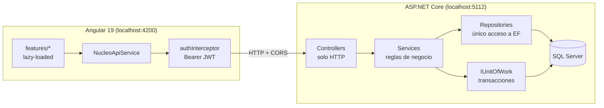
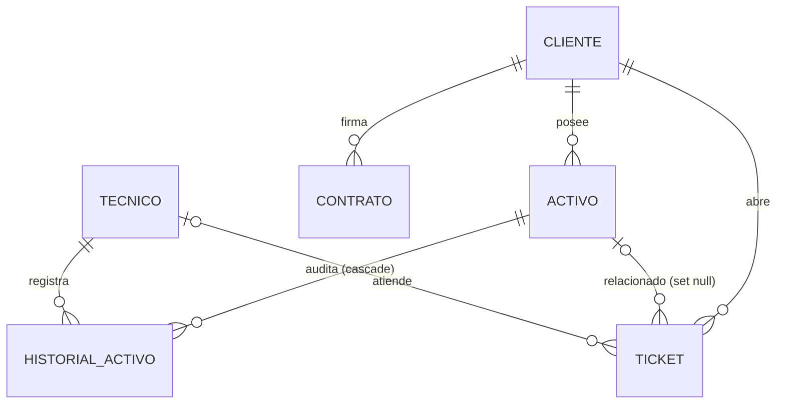

# Núcleo — Gestión de activos IT

[](https://github.com/nickDIA/ITServiceManager/actions/workflows/ci.yml)
[](https://github.com/nickDIA/ITServiceManager/actions/workflows/lighthouse.yml)


Plataforma full-stack para que un proveedor de servicios IT administre a varias empresas cliente: su inventario de activos (hardware, software, equipo de red), los tickets de servicio y el contrato mensual de cada una. Los técnicos atienden tickets y cambian el estado de los activos, y cada cambio queda auditado.

**Backend** ASP.NET Core (.NET 10) + EF Core + SQL Server · **Frontend** Angular 19 (standalone components + signals) · **Auth** JWT con roles · **CI** GitHub Actions

---

## Funcionalidades

- **Clientes y activos**: CRUD con paginación en el servidor y scroll infinito, filtro de activos por cliente.
- **Ciclo de vida del activo**: máquina de estados (`Operativo`, `EnReparacion`, `EnAlmacen`, `Retirado`) con **historial de auditoría transaccional**: el cambio de estado y su registro se guardan juntos o no se guarda ninguno.
- **Tickets en tablero kanban**: `Abierto → EnProgreso → Resuelto → Cerrado` (más `Cancelado`), una columna por estado y paginada de forma independiente.
- **Alertas de SLA**: cada ticket abierto muestra una alerta ámbar al llegar al 80 % del tiempo de respuesta contratado y una roja al vencerse.
- **Dashboard**: activos y tickets por estado/prioridad, ingreso mensual recurrente, horas promedio por contrato y clientes sin tickets pendientes, todo calculado en SQL.
- **Roles**: `Admin`, `Tecnico` (lectura + escritura) y `Lector` (solo lectura). La UI se adapta al rol y la API lo hace cumplir (403).

## Arquitectura



La separación en capas es estricta y es el núcleo del proyecto:

| Capa | Responsabilidad | Nunca hace |
|---|---|---|
| **Controllers** | Traducir HTTP ⇄ llamadas al servicio, `[Authorize]` | Lógica de negocio, EF Core |
| **Services** | Validación, conflictos, orquestación, transacciones, mapeo a DTOs | Tocar `DbContext` |
| **Repositories** | Consultas EF Core (`Include`, paginación, agregaciones) | Reglas de negocio, `SaveChanges` |

Los errores de dominio (`RecursoNoEncontradoException`, `ConflictoException`, …) se traducen a `ProblemDetails` con su código HTTP en un único `IExceptionHandler` global.

### Modelo de datos



## Decisiones técnicas destacadas

**Transacción explícita entre repositorios.** Cambiar el estado de un activo escribe en `Activos` y en `HistorialActivo`. Como los repositorios no llaman a `SaveChanges` por su cuenta, dos guardados seguidos serían dos transacciones implícitas distintas. Un `IUnitOfWork` envuelve `IDbContextTransaction` sin exponer tipos de EF a la capa de servicios y revierte todo si falla la auditoría. Ver [`ActivoService.CambiarEstadoAsync`](backend/Nucleo.Api/Services/ActivoService.cs).

**Claims JWT cortos.** El token usa `sub`/`role` en vez de las URIs largas de `ClaimTypes`, para que Angular lea `payload.role` directamente. Esto exige `MapInboundClaims = false` en el backend; sin eso, `[Authorize(Roles=…)]` devuelve 403 en todos los endpoints y no da ninguna pista. Este bug solo apareció al probar en un navegador real, igual que la falta de CORS.

**Rendimiento medido, no supuesto.** Con un generador de datos de carga (`seed-bulk`: 1k clientes, 50k activos, 200k tickets) se midió y corrigió:

| Hallazgo | Causa | Fix | Antes → Después |
|---|---|---|---|
| `GET /tickets` | Devolvía el conjunto completo | Paginación por columna del kanban | 85 MB · ~9.6 s → **8.3 KB · ~13 ms** |
| Dashboard | `GROUP BY` sobre tablas completas | Índices compuestos | 1592 ms → **295 ms** |
| `GET /activos` paginado | `ORDER BY Nombre` sin índice | Índice en `Nombre` | 147 ms → **13 ms** |

La lección: un índice reduce el costo de la consulta, pero no arregla la decisión de traer todos los registros.

**Signals en Angular, cada patrón donde corresponde.** `async` pipe en Clientes, `effect` para el filtro de Activos, `computed` para las alertas de SLA y el dashboard. Las alertas de SLA se calculan una vez por recálculo en lugar de llamar a `Date.now()` desde el template, que provocaba `NG0100 ExpressionChangedAfterItHasBeenChecked`.

## Cómo ejecutarlo

### Requisitos

- [.NET SDK 10](https://dotnet.microsoft.com/download)
- [Node.js 20](https://nodejs.org/)
- SQL Server Express (instancia `.\SQLEXPRESS`, autenticación de Windows)
- `dotnet-ef` para crear migraciones: `dotnet tool install --global dotnet-ef`

### Backend

```bash
# 1. Clave de firma JWT (no vive en appsettings.json)
cd backend/Nucleo.Api
dotnet user-secrets set "Jwt:Key" "una-clave-larga-de-al-menos-32-caracteres"
cd ../..

# 2. Ejecutar: en Development aplica migraciones y carga datos demo automáticamente
dotnet run --project backend/Nucleo.Api/Nucleo.Api.csproj --launch-profile http
```

API en `http://localhost:5112`, Swagger UI en `http://localhost:5112/swagger`.

### Frontend

```bash
npm install --prefix frontend
npm start --prefix frontend
```

App en `http://localhost:4200`. Necesita la API corriendo al mismo tiempo.

### Usuarios demo

Todos con la contraseña `Nucleo123!` (solo existen en la base de datos local de desarrollo):

| Email | Rol |
|---|---|
| `diego.torres@nucleo.mx` | Admin |
| `carlos.mendez@nucleo.mx` | Tecnico |
| `sofia.ramirez@nucleo.mx` | Lector |

### Datos de carga (opcional)

```bash
dotnet run --project backend/Nucleo.Api -- seed-bulk realista   # 50 clientes · 800 activos · 3k tickets
dotnet run --project backend/Nucleo.Api -- seed-bulk estres     # 1k clientes · 50k activos · 200k tickets
```

Es idempotente: volver a ejecutarlo solo completa lo que falte para llegar al nivel.

## Pruebas y CI

```bash
dotnet test backend/Nucleo.Api.Tests/Nucleo.Api.Tests.csproj          # 85 pruebas (xUnit + Moq)
npm test --prefix frontend -- --watch=false --browsers=ChromeHeadless
```

- **Backend:** la capa de servicios con repositorios simulados (sin base de datos), incluido el rollback de la transacción ante una violación de FK, más las máquinas de estados. Detalle de cobertura y registro de validación manual por fase en [`docs/TESTING.md`](docs/TESTING.md).
- **`ci.yml`:** build + pruebas de backend y frontend en cada push/PR a `main`.
- **`lighthouse.yml`:** auditoría Lighthouse del frontend; accesibilidad y buenas prácticas deben dar 100.
- **Accesibilidad:** las 6 rutas sin violaciones WCAG 2 AA (axe-core) y sin desbordamiento horizontal a 375 px y 1280 px.

## API

| Recurso | Endpoints |
|---|---|
| Auth | `POST /api/auth/login` |
| Clientes | `GET/POST /api/clientes` · `GET/PUT/DELETE /api/clientes/{id}` |
| Activos | `GET/POST /api/activos` · `GET/PUT/DELETE /api/activos/{id}` · `PATCH /api/activos/{id}/estado` · `GET /api/activos/{id}/historial` |
| Tickets | `GET/POST /api/tickets` · `GET/PUT/DELETE /api/tickets/{id}` · `PATCH /api/tickets/{id}/estado` |
| Técnicos | `GET /api/tecnicos` |
| Reportes | `GET /api/reportes/dashboard` |

Los listados aceptan `?pagina=&tamano=` (máximo 100 por página) y devuelven `{ items, pagina, tamanoPagina, totalRegistros, hayMas }`. La especificación completa está en Swagger.

## Estructura

```
backend/
  Nucleo.Api/          Controllers · Services · Repositories · Data · Domain · Models · Common
  Nucleo.Api.Tests/    Pruebas de servicios y máquinas de estados
frontend/src/app/
  core/                Auth, interceptor, guards, cliente HTTP, modelos
  features/            clientes · activos · tickets · dashboard · admin · login
docs/TESTING.md        Cobertura y registro de validación
```

## Pendiente

- Actualizaciones en tiempo real con SignalR
- Exportación de reportes
